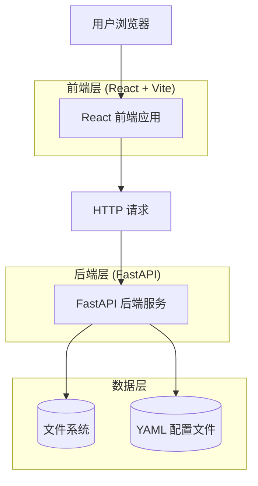
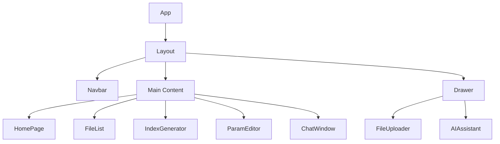

# UltraRAG Web 前端技术架构文档

## 1. 架构设计

### 1.1 系统架构图



### 1.2 技术栈选择

| 层级 | 技术 | 版本 |
|------|------|------|
| 前端框架 | React | 18.x |
| 构建工具 | Vite | 5.x |
| UI 组件库 | Tailwind CSS | 3.x |
| 状态管理 | React Context API | 内置 |
| HTTP 客户端 | Axios | 1.x |
| 后端框架 | FastAPI | 0.109.x |
| Python 版本 | Python | 3.10+ |

### 1.3 项目结构

```
ultrarag/
├── .trae/
│   └── documents/           # 文档目录
├── ui/
│   ├── frontend/            # 前端项目
│   │   ├── src/
│   │   │   ├── components/ # React 组件
│   │   │   ├── pages/       # 页面组件
│   │   │   ├── hooks/       # 自定义 Hooks
│   │   │   ├── services/    # API 服务
│   │   │   ├── context/    # React Context
│   │   │   └── utils/       # 工具函数
│   │   ├── public/         # 静态资源
│   │   ├── index.html      # 入口 HTML
│   │   ├── vite.config.ts  # Vite 配置
│   │   └── package.json    # 依赖配置
│   └── backend/             # 后端服务
│       ├── app.py          # FastAPI 应用
│       └── pipeline_manager.py
├── app.py                   # 主后端入口
└── data/                    # 数据目录
```

---

## 2. 路由定义

| 路由 | 页面 | 说明 |
|------|------|------|
| `/` | 首页 | 欢迎页面 + 功能导航 |
| `/files` | 文件管理 | 文件列表、上传、下载 |
| `/index` | 索引管理 | 生成索引、查看状态 |
| `/params` | 参数配置 | Pipeline 参数配置 |
| `/chat` | AI 对话 | 聊天界面 |

---

## 3. 组件结构

### 3.1 核心组件

| 组件名称 | 路径 | 功能 |
|----------|------|------|
| `App` | `src/App.tsx` | 根组件，路由配置 |
| `Layout` | `src/components/Layout.tsx` | 布局容器，包含导航栏 |
| `Drawer` | `src/components/Drawer.tsx` | 推送抽屉组件 |
| `Navbar` | `src/components/Navbar.tsx` | 顶部导航栏 |
| `FileList` | `src/pages/FileList.tsx` | 文件列表页面 |
| `FileUploader` | `src/components/FileUploader.tsx` | 文件上传组件 |
| `IndexGenerator` | `src/pages/IndexGenerator.tsx` | 索引生成页面 |
| `ParamEditor` | `src/pages/ParamEditor.tsx` | 参数编辑页面 |
| `ChatWindow` | `src/pages/ChatWindow.tsx` | 聊天窗口组件 |
| `AIAssistant` | `src/components/AIAssistant.tsx` | AI 助手抽屉 |

### 3.2 组件层级



---

## 4. API 定义

### 4.1 API 服务层

```typescript
// src/services/api.ts

import axios from 'axios';

const API_BASE_URL = import.meta.env.VITE_API_BASE_URL || 'http://localhost:8000';

const apiClient = axios.create({
  baseURL: API_BASE_URL,
  timeout: 30000,
  headers: {
    'Content-Type': 'application/json',
  },
});

// 响应拦截器
apiClient.interceptors.response.use(
  (response) => response.data,
  (error) => {
    console.error('API Error:', error);
    return Promise.reject(error);
  }
);

export const api = {
  // 生成索引
  generateIndex: (pipelineFile: string) =>
    apiClient.post('/generate-index', { pipeline_file: pipelineFile }),
  
  // 上传文件
  uploadFile: (file: File) => {
    const formData = new FormData();
    formData.append('file', file);
    return apiClient.post('/upload-file', formData, {
      headers: { 'Content-Type': 'multipart/form-data' },
    });
  },
  
  // 上传文件夹
  uploadFolder: (files: File[]) => {
    const formData = new FormData();
    files.forEach((file) => formData.append('files', file));
    return apiClient.post('/upload-folder', formData, {
      headers: { 'Content-Type': 'multipart/form-data' },
    });
  },
  
  // 下载文件
  downloadFile: (filePath: string) =>
    apiClient.get('/download-file', { params: { file_path: filePath } }),
  
  // 列出文件
  listFiles: (directory: string = 'data') =>
    apiClient.get('/list-files', { params: { directory } }),
  
  // 获取 Pipeline 列表
  getPipelines: () => apiClient.get('/pipelines'),
  
  // 获取 Pipeline 参数
  getPipelineParams: (parameterFile: string) =>
    apiClient.get('/pipeline-params', { params: { parameter_file } }),
  
  // 更新 Pipeline 参数
  updatePipelineParams: (parameterFile: string, params: object) =>
    apiClient.put('/pipeline-params', { parameter_file: parameterFile, params }),
};
```

### 4.2 API 类型定义

```typescript
// src/types/api.ts

export interface IndexRequest {
  pipeline_file: string;
}

export interface FileItem {
  name: string;
  type: 'file' | 'directory';
  path: string;
}

export interface ListFilesResponse {
  status: string;
  directory: string;
  files: FileItem[];
}

export interface PipelineItem {
  name: string;
  path: string;
}

export interface PipelineParams {
  [key: string]: any;
}

export interface ApiResponse<T = any> {
  status: 'success' | 'error';
  message?: string;
  data?: T;
}
```

---

## 5. 状态管理

### 5.1 React Context 设计

```typescript
// src/context/AppContext.tsx

import React, { createContext, useContext, useState, ReactNode } from 'react';

interface AppState {
  drawerOpen: boolean;
  currentPage: string;
  selectedPipeline: string | null;
}

interface AppContextType {
  state: AppState;
  openDrawer: () => void;
  closeDrawer: () => void;
  setCurrentPage: (page: string) => void;
  setSelectedPipeline: (pipeline: string) => void;
}

const AppContext = createContext<AppContextType | undefined>(undefined);

export function AppProvider({ children }: { children: ReactNode }) {
  const [state, setState] = useState<AppState>({
    drawerOpen: false,
    currentPage: 'home',
    selectedPipeline: null,
  });

  const openDrawer = () => setState((s) => ({ ...s, drawerOpen: true }));
  const closeDrawer = () => setState((s) => ({ ...s, drawerOpen: false }));
  const setCurrentPage = (page: string) => setState((s) => ({ ...s, currentPage: page }));
  const setSelectedPipeline = (pipeline: string) =>
    setState((s) => ({ ...s, selectedPipeline: pipeline }));

  return (
    <AppContext.Provider
      value={{ state, openDrawer, closeDrawer, setCurrentPage, setSelectedPipeline }}
    >
      {children}
    </AppContext.Provider>
  );
}

export function useApp() {
  const context = useContext(AppContext);
  if (!context) throw new Error('useApp must be used within AppProvider');
  return context;
}
```

---

## 6. 样式规范

### 6.1 Tailwind CSS 配置

```javascript
// tailwind.config.js

/** @type {import('tailwindcss').Config} */
export default {
  content: [
    "./index.html",
    "./src/**/*.{js,ts,jsx,tsx}",
  ],
  theme: {
    extend: {
      colors: {
        primary: {
          DEFAULT: '#3B82F6',
          hover: '#2563EB',
        },
        secondary: '#6B7280',
        success: '#10B981',
        warning: '#F59E0B',
        error: '#EF4444',
      },
      fontFamily: {
        sans: ['Inter', '-apple-system', 'BlinkMacSystemFont', 'Segoe UI', 'sans-serif'],
        mono: ['JetBrains Mono', 'Fira Code', 'Consolas', 'monospace'],
      },
      spacing: {
        'drawer': '280px',
        'drawer-expanded': '360px',
      },
      transitionProperty: {
        'drawer': 'transform',
      },
    },
  },
  plugins: [],
}
```

### 6.2 推送抽屉动画

```css
/* src/index.css */

@layer utilities {
  .drawer-enter {
    transform: translateX(-100%);
  }
  
  .drawer-enter-active {
    transform: translateX(0);
    transition: transform 300ms ease-out;
  }
  
  .drawer-exit {
    transform: translateX(0);
  }
  
  .drawer-exit-active {
    transform: translateX(-100%);
    transition: transform 300ms ease-in;
  }
}

/* 遮罩层过渡 */
.overlay-enter {
  opacity: 0;
}

.overlay-enter-active {
  opacity: 1;
  transition: opacity 300ms ease-out;
}

.overlay-exit {
  opacity: 1;
}

.overlay-exit-active {
  opacity: 0;
  transition: opacity 300ms ease-in;
}
```

---

## 7. 部署配置

### 7.1 开发环境

```bash
# 前端
cd ui/frontend
npm install
npm run dev

# 后端
cd ui/backend
pip install -r requirements.txt
python app.py
```

### 7.2 生产环境

```bash
# 构建前端
cd ui/frontend
npm run build

# 使用 FastAPI 服务静态文件
# 后端 app.py 已配置 static_folder
python app.py
```

---

## 8. 安全考虑

- 文件上传需要验证文件类型和大小
- 下载文件需要防止路径遍历攻击（已在后端实现）
- API 请求添加错误处理和超时控制
- 敏感配置不存储在前端代码中
