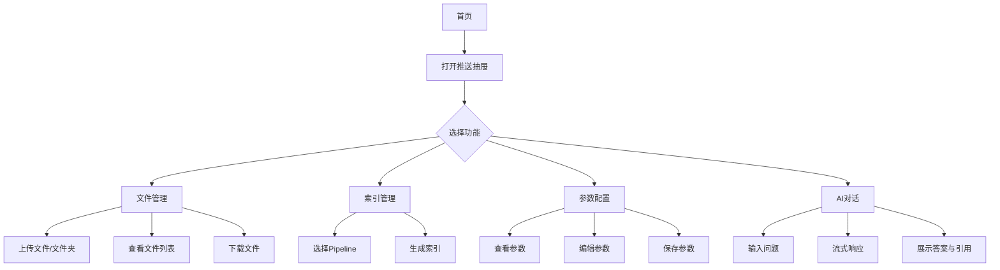
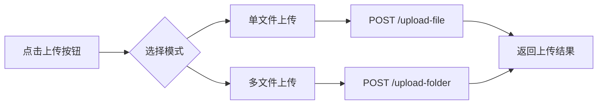
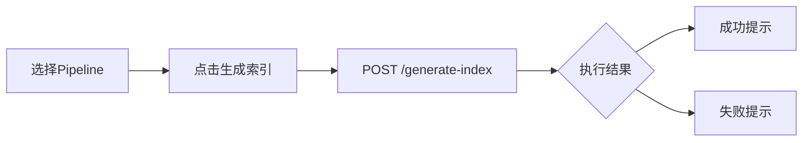

# UltraRAG Web 前端产品需求文档

## 1. 产品概述

UltraRAG Web 前端是一个基于 RAG（检索增强生成）技术的流水线配置与管理平台。用户可以通过可视化界面管理 RAG 流水线、上传文档、生成索引、配置参数，并与 AI 进行交互式对话。

### 核心目标
- 提供直观的可视化界面，用于配置和管理 UltraRAG 流水线
- 支持文件上传、索引生成、参数配置等核心功能
- 实现流畅的推拉交互体验，提升用户操作效率

### 目标用户
- RAG 应用开发者
- 数据科学家
- AI 工程师
- 需要构建知识库的企业用户

---

## 2. 功能需求

### 2.1 用户角色

本产品为单一用户角色设计，无需登录即可使用基础功能。

| 角色 | 注册方式 | 核心权限 |
|------|----------|----------|
| 普通用户 | 无需注册 | 使用全部功能：文件管理、索引生成、参数配置、AI 对话 |

### 2.2 功能模块

产品包含以下核心功能模块：

1. **首页/仪表盘** - 展示流水线状态、快速入口
2. **文件管理** - 上传、下载、列出文件
3. **索引管理** - 生成索引、查看索引状态
4. **参数配置** - Pipeline 参数配置与更新
5. **AI 对话** - 与配置好的流水线进行交互式对话
6. **AI 助手** - 提供配置建议和帮助

### 2.3 页面详情

| 页面名称 | 模块名称 | 功能描述 |
|----------|----------|----------|
| 首页 | 欢迎区域 | 显示产品 Logo、当前流水线状态、快速操作入口 |
| 首页 | 推送抽屉 | 从左侧滑出的功能导航栏，包含 Pipeline/参数/提示词/聊天入口 |
| 文件管理 | 文件列表 | 展示 data 目录下的所有文件和文件夹 |
| 文件管理 | 单文件上传 | 支持拖拽或点击上传单个文件到 data 目录 |
| 文件管理 | 多文件上传 | 支持上传整个文件夹（多个文件） |
| 文件管理 | 文件下载 | 支持从 data 目录下载指定文件 |
| 索引管理 | Pipeline 选择 | 选择要使用的 Pipeline 配置文件 |
| 索引管理 | 索引生成 | 触发后端索引生成任务，显示进度和结果 |
| 参数配置 | 参数展示 | 以表单形式展示当前 Pipeline 的所有参数 |
| 参数配置 | 参数编辑 | 修改参数值并保存到后端 |
| 参数配置 | 参数推送 | 侧边栏抽屉形式展示和编辑参数 |
| AI 对话 | 对话界面 | 聊天消息展示区域，支持流式输出 |
| AI 对话 | 输入区域 | 用户输入问题，发送请求 |
| AI 对话 | 历史记录 | 显示对话历史，支持继续上下文对话 |
| AI 助手 | 助手面板 | 右侧滑出抽屉，提供配置建议 |

---

## 3. 核心流程

### 3.1 主流程图



### 3.2 文件管理流程



### 3.3 索引生成流程



---

## 4. 用户界面设计

### 4.1 设计风格

#### 配色方案
- **主色**: `#3B82F6` (蓝色 - 主要按钮、链接、激活状态)
- **次色**: `#6B7280` (灰色 - 次要文本、非激活状态)
- **背景色**: `#FFFFFF` (白色 - 主背景)
- **侧边栏背景**: `#F9FAFB` (浅灰 - 推送抽屉背景)
- **边框色**: `#E5E7EB` (浅灰 - 分隔线、边框)
- **成功色**: `#10B981` (绿色 - 成功状态)
- **警告色**: `#F59E0B` (橙色 - 警告状态)
- **错误色**: `#EF4444` (红色 - 错误状态)

#### 按钮样式
- **主要按钮**: 圆角 `6px`，蓝色背景 `#3B82F6`，白色文字
- **次要按钮**: 圆角 `6px`，白色背景，灰色边框 `#E5E7EB`
- **图标按钮**: 圆形或圆角方形，无边框，悬停时显示背景色

#### 字体
- **主字体**: `Inter`, `-apple-system`, `BlinkMacSystemFont`, `Segoe UI`, sans-serif
- **代码字体**: `JetBrains Mono`, `Fira Code`, `Consolas`, monospace
- **标题大小**: `24px` (h1), `20px` (h2), `16px` (h3)
- **正文大小**: `14px`
- **小字**: `12px`

#### 布局风格
- **卡片式布局**: 内容块使用白色背景，轻微阴影 `box-shadow: 0 1px 3px rgba(0,0,0,0.1)`
- **顶部导航栏**: 固定高度 `56px`，包含 Logo 和右侧操作按钮
- **推送抽屉**: 从左侧滑出，宽度 `280px`，带有半透明遮罩层

### 4.2 页面设计概述

| 页面名称 | 模块名称 | UI 元素 |
|----------|----------|---------|
| 首页 | 顶部导航栏 | 固定定位，白色背景，Logo + 当前流水线标签 + AI助手按钮 |
| 首页 | 推送抽屉 | 左侧侧边栏，深灰色图标按钮，激活态蓝色高亮 |
| 首页 | 欢迎区域 | 居中布局，大标题 + 描述文字 + 快速操作按钮组 |
| 文件管理 | 文件列表 | 表格/网格布局，显示文件名、类型、大小、操作按钮 |
| 文件管理 | 上传区域 | 虚线边框拖拽区域，支持点击和拖拽上传 |
| 索引管理 | Pipeline 选择 | 下拉选择框，显示可用 Pipeline 列表 |
| 索引管理 | 生成按钮 | 大型主按钮，Loading 状态显示加载动画 |
| 参数配置 | 参数表单 | 分组折叠面板，每组一个或多个表单项 |
| 参数配置 | 保存按钮 | 底部固定或跟随表单，保存成功后显示Toast提示 |
| AI 对话 | 消息列表 | 气泡样式，用户消息右对齐，AI消息左对齐 |
| AI 对话 | 输入框 | 底部固定，文本域 + 发送按钮，支持 Enter 发送 |

### 4.3 推送设计（侧边栏抽屉）

#### 设计规范
- **抽屉宽度**: `280px` (紧凑模式), `360px` (展开模式)
- **动画效果**: `transform: translateX()` + `transition: 0.3s ease`
- **遮罩层**: 黑色半透明背景 `rgba(0,0,0,0.5)`，点击可关闭
- **触发方式**: 点击导航图标或汉堡菜单按钮

#### 交互行为
1. 点击左侧导航图标 → 抽屉从左侧滑入 → 遮罩层渐显
2. 点击遮罩层/关闭按钮 → 抽屉滑出 → 遮罩层渐隐
3. 抽屉内支持滚动查看更多内容
4. 切换不同功能模块时，抽屉内容动态更新

### 4.4 响应式设计

- **桌面端优先**: `≥1024px` 完整布局
- **平板端**: `768px - 1023px` 抽屉自动折叠
- **移动端**: `<768px` 抽屉全屏显示，底部导航栏

---

## 5. API 对接方案

### 5.1 后端 API 列表

| 接口 | 方法 | 参数 | 说明 |
|------|------|------|------|
| `/generate-index` | POST | `pipeline_file`: string | 生成索引 |
| `/upload-file` | POST | `file`: File | 单文件上传 |
| `/upload-folder` | POST | `files`: File[] | 多文件上传 |
| `/download-file` | GET | `file_path`: string | 下载文件 |
| `/list-files` | GET | `directory`: string | 列出文件 |
| `/pipelines` | GET | - | 获取可用 Pipeline 列表 |
| `/pipeline-params` | GET | `parameter_file`: string | 获取 Pipeline 参数 |
| `/pipeline-params` | PUT | `parameter_file`, `params`: dict | 更新 Pipeline 参数 |

### 5.2 请求与响应示例

#### 生成索引
```
POST /generate-index
Content-Type: application/json

{
  "pipeline_file": "examples/sherpa_index.yaml"
}

Response:
{
  "status": "success",
  "message": "索引生成成功"
}
```

#### 上传文件
```
POST /upload-file
Content-Type: multipart/form-data

Response:
{
  "status": "success",
  "message": "文件上传成功",
  "filename": "example.txt",
  "path": "data/example.txt"
}
```

#### 列出文件
```
GET /list-files?directory=data

Response:
{
  "status": "success",
  "directory": "data",
  "files": [
    {"name": "example.txt", "type": "file", "path": "example.txt"},
    {"name": "subfolder", "type": "directory", "path": "subfolder"}
  ]
}
```

---

## 6. 非功能性需求

### 6.1 性能要求
- 页面首次加载时间 < 2秒
- API 请求响应时间 < 1秒（不含业务处理）
- 动画流畅度 ≥ 30fps

### 6.2 兼容性要求
- Chrome 最新版
- Firefox 最新版
- Safari 最新版
- Edge 最新版

### 6.3 可访问性
- 支持键盘导航
- 颜色对比度符合 WCAG AA 标准
- 按钮和链接有明确的焦点状态
